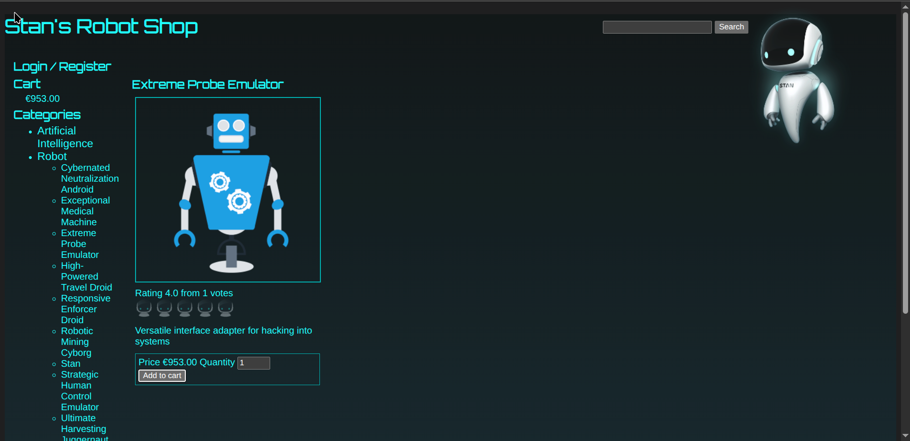
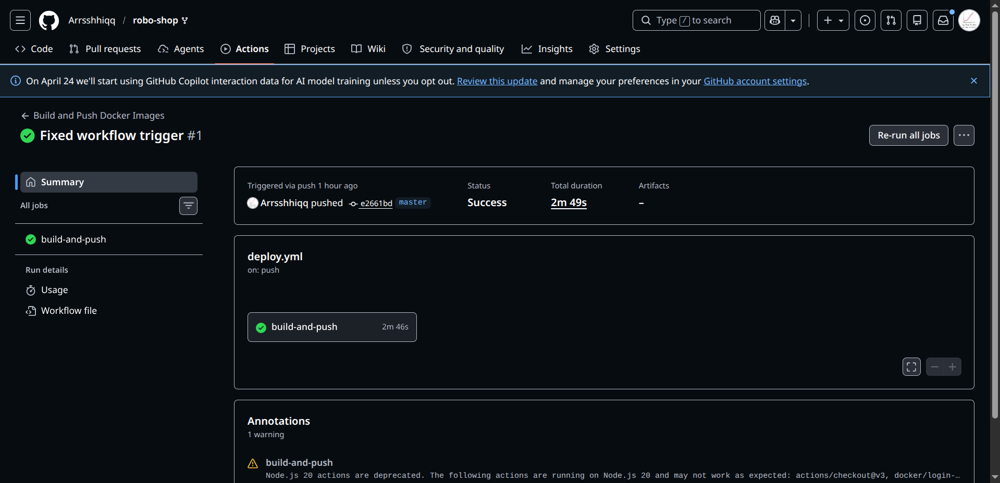
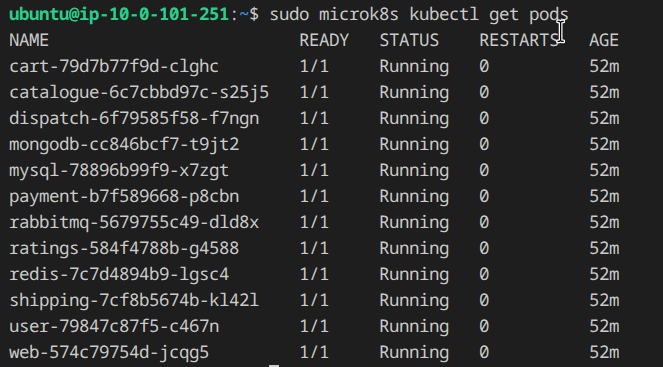

# Project 3: Automated Multi-Tier Application Deployment

## Stan's Robot Shop

This repository contains the source code for Stan's Robot Shop, a sample microservices application. For **Project 3**, this deployment has been entirely refactored to utilize a streamlined GitOps and CI/CD workflow, deploying to a local Kubernetes cluster on a single AWS EC2 instance.

---

## 🏗️ Architecture Summary

The architecture has been shifted from a managed EKS cluster to a self-managed Kubernetes cluster on a single EC2 instance to satisfy the project rubric.

- **Infrastructure**: A single AWS EC2 instance (`t3.large`) is provisioned via **Terraform** in a public subnet, with a security group allowing SSH, HTTP/HTTPS, K8s API access, and NodePort access (Port 30080).
- **Cluster Configuration**: **Ansible** is used to configure the EC2 instance, installing **MicroK8s** (a lightweight upstream Kubernetes) and enabling critical add-ons (DNS, Storage, Ingress).
- **CI/CD Pipeline**: **GitHub Actions** automatically builds the 8 microservice Docker images on every push to the `master` branch and pushes them securely to the **GitHub Container Registry (GHCR)**.
- **Orchestration**: Standard **Kubernetes Manifests** (Deployments and Services) handle the clustering, load balancing, and network isolation of the 12 total containers (8 microservices + 4 databases).

---

## 🚀 Deployment Instructions

Follow these exact steps to replicate the deployment from scratch.

### Step 1: Provision Infrastructure (Terraform)
Ensure you have your AWS credentials configured (`aws configure`).

```bash
cd terraform
terraform init
terraform plan
terraform apply -auto-approve
```
*Take note of the `k8s_node_public_ip` and `k8s_node_private_key` shown in the outputs.*
*Export the private key to a file and fix permissions:*
```bash
terraform output -raw k8s_node_private_key > k8s_key.pem
chmod 400 k8s_key.pem
```

### Step 2: Configure the Cluster (Ansible)
Navigate to the Ansible directory and run the playbook to install MicroK8s on the newly created EC2 instance.

```bash
cd ../ansible
# Run the playbook using the EC2 Public IP and the generated SSH key
ansible-playbook -i "<YOUR_EC2_PUBLIC_IP>," -u ubuntu --private-key ../terraform/k8s_key.pem setup-microk8s.yml
```

### Step 3: Trigger the CI/CD Pipeline (GitHub Actions)
The pipeline is fully automated. To trigger it, simply commit and push your code to the `master` branch.

```bash
git add .
git commit -m "Trigger build and push pipeline"
git push origin master
```
1. Go to the **Actions** tab in your GitHub repository to watch the pipeline build and push the 8 Docker images.
2. Once complete, navigate to your GitHub Profile **Packages** tab.
3. **Important:** Ensure all 8 packages are set to **Public** visibility so the Kubernetes cluster can pull them without authentication.

### Step 4: Deploy Kubernetes Manifests
SSH into your EC2 instance and apply the manifests.

```bash
ssh -i terraform/k8s_key.pem ubuntu@<YOUR_EC2_PUBLIC_IP>
git clone https://github.com/<YOUR_GITHUB_USERNAME>/robo-shop.git
cd robo-shop

# Apply databases and microservices
sudo microk8s kubectl apply -f K8s/manifests/
```
Verify the pods are spinning up:
```bash
sudo microk8s kubectl get pods -w
```

---

## 🌐 Accessing the Application

Once all pods show a status of `Running`, the frontend website is exposed via a NodePort on port `30080`.

Open your browser and navigate to:
**http://<YOUR_EC2_PUBLIC_IP>:30080**

---

## 📸 Project Evidence

### Live Robot Shop Webpage
 

### Successful GitHub Actions Pipeline


### Successful Pods Running
